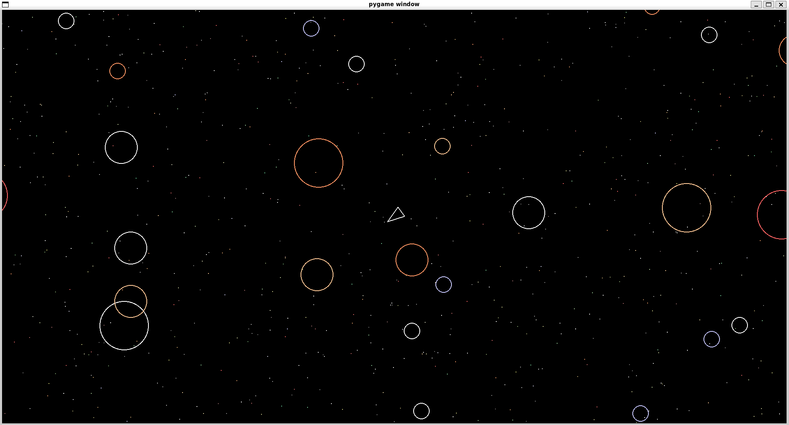

# Asteroids Game

A modern take on the classic **Asteroids** arcade game, built using **Python** and **Pygame**. Navigate your spaceship, avoid collisions with asteroids, and blast them into smaller pieces — all while flying through a star-filled galaxy.



## Features

- 🎮 **Responsive Controls**: Smooth movement, rotation, and shooting mechanics.
- 🌠 **Dynamic Asteroids**: Asteroids split into smaller pieces upon impact, keeping the action intense.
- 🌌 **Starfield Background**: A beautiful, procedurally generated starry backdrop.
- 📏 **Resizable Window**: Adjust the game screen size dynamically — asteroids, stars, and player elements adapt instantly.
- 💥 **Collision Detection**: Realistic collision handling between asteroids, shots, and the player.
- 🚀 **Apparent movement**: While the spaceship can rotate and shoot projectiles, its forward/backwards movement is only apparent. Instead the stars and asteroids move in relation to its forward vector, which creates the optical illusion of the spaceship moving forwards or backwards.

## Project Structure

📦 asteroids   
├── 📄 [asteroid.py](https://github.com/OferRavid/asteroids/blob/master/asteroid.py)                 # Asteroid class and behavior    
├── 📄 [asteroidfield.py](https://github.com/OferRavid/asteroids/blob/master/asteroidfield.py) # Manages asteroid spawning and limits    
├── 📄 [circleshape.py](https://github.com/OferRavid/asteroids/blob/master/circleshape.py)    # Base class for circular game objects (asteroids, shots, player)    
├── 📄 [constants.py](https://github.com/OferRavid/asteroids/blob/master/constants.py)          # Game constants (sizes, speeds, colors)    
├── 📄 [main.py](https://github.com/OferRavid/asteroids/blob/master/main.py)                            # Main game loop and event handling    
├── 📄 [player.py](https://github.com/OferRavid/asteroids/blob/master/player.py)                       # Player spaceship class and controls    
├── 📄 [shot.py](https://github.com/OferRavid/asteroids/blob/master/shot.py)                               # Projectile behavior    
├── 📄 [star.py](https://github.com/OferRavid/asteroids/blob/master/star.py)                                # Starfield animation    
├── 📄 README.md                                                                                                                                                # Project overview and instructions    
└── 📄 LICENSE

## Code Overview

- `main.py`: Initializes Pygame, sets up the game window, and runs the main game loop.

- `player.py`: Contains the Player class for controlling the spaceship.

- `asteroid.py`: Defines the Asteroid class, including asteroid movement, splitting, and screen wrapping.

- `shot.py`: Implements the Shot class for player projectiles.

- `asteroidfield.py`: Manages asteroid spawning logic, ensuring new asteroids appear from screen edges.

- `star.py`: Handles star animations for the dynamic background.

- `constants.py`: Stores global game settings like screen size, asteroid speeds, and player attributes.

- `circleshape.py`: A base class for all circular game objects, adding common features like movement and collision detection.

## Customization

You can tweak the gameplay by modifying **constants.py**:

```python
# Change the screen size
SCREEN_WIDTH = 1280
SCREEN_HEIGHT = 720

# Adjust asteroid behavior
ASTEROID_MIN_RADIUS = 20
ASTEROID_SPAWN_RATE = 0.8
ASTEROIDS_MAX_SPAWN = 25

# Player settings
PLAYER_SPEED = 200
PLAYER_SHOOT_COOLDOWN = 0.3
```

Feel free to experiment with these values to create your own version of Asteroids!

---

## Installation


1. Clone the repository and navigate to the project folder:

```bash
git clone https://github.com/OferRavid/asteroids.git
cd asteroids
```

2. Ensure you have **Python 3.10+** installed, along with **Pygame**:

```bash
# Install Pygame
pip install pygame
```
or
```bash
pip install -r requirements.txt
```
You can also use virtual environment:
```bash
python -m venv venv
source venv/bin/activate  # On Windows use 'venv\\Scripts\\activate'
pip install -r requirements.txt
```


## Running the Game

Launch the game by running:

```bash
python main.py
```

The game window will open, and you can start playing!

## How to Play

- **W / S** — Move forward / backward.
- **A / D** — Rotate left / right.
- **Space** — Shoot projectiles.
- **Resize window** — Dynamically adjusts game elements.
- **Close button** — Quit the game.

Your goal is to avoid and destroy asteroids. Each time you shoot a larger asteroid, it splits into two smaller ones. Keep dodging and shooting until you clear the screen — or get hit!

---
## Dependencies

- Python 3.10+
- Pygame

## Contributing

Contributions are welcome! If you want to add new features, fix bugs, or improve performance, feel free to open a pull request.

## License

This project is licensed under the MIT License. See [LICENSE](https://github.com/OferRavid/asteroids/blob/master/LICENSE) for details.

---

Get ready to blast some asteroids and test your survival skills! 🚀

---
---
#### This project is a part of the Backend Developer roadmap on boot.dev
